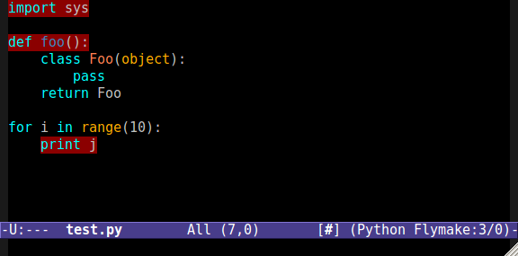
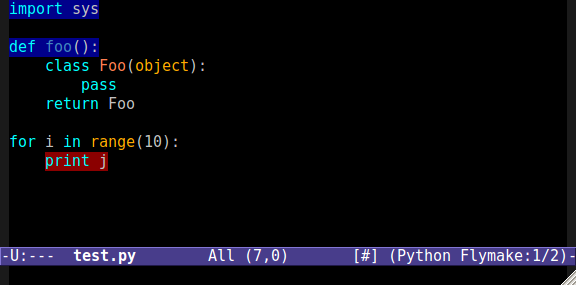

:Date: 2011-10-18 18:30:00

============================================
 Better Python Flymake Integration in Emacs
============================================

Flymake is a great feature in Emacs for getting warnings and errors in source
code as you type it. When I am coding in Python I like to use PEP8_ and
pyflakes_ to warn me about stylistic and potential errors. I integrated those
tools into Emacs by following the guide at
http://reinout.vanrees.org/weblog/2010/05/11/pep8-pyflakes-emacs.html

However, I find it annoying that all output from PEP8 and pyflakes is treated
as an error by flymake. Notice in the following image that only the last
highlighted line is an error, while the rest of the lines should be treated as
warnings.

Wouldn't it be much better if flymake treated the warning lines as warnings,
and highlighted them as such?

We can accomplish this by modifying the output of PEP8 and pyflakes such that
flymake correctly recognizes messages as warnings. The following code does
just that (and runs both PEP8 and pyflakes on the input):

.. code-block:: python

    #!/usr/bin/env python
    
    import commands
    import re
    import sys
    
    def make_re(*msgs):
        return re.compile('(%s)' % '|'.join(msgs))
    
    pyflakes_ignore = make_re('unable to detect undefined names')
    pyflakes_warning = make_re(
        'imported but unused',
        'is assigned to but never used',
        'redefinition of unused',
    )
    pep8_ignore = ['E501']
    pep8_warning = make_re('.')
    
    def run(cmd, ignore_re, warning_re):
        output = commands.getoutput(cmd)
        for line in output.splitlines():
            if ignore_re and ignore_re.search(line):
                continue
            elif ': ' in line and warning_re.search(line):
                line = '%s: WARNING %s' % tuple(line.split(': ', 1))
            print line
    
    run('pyflakes %s' % sys.argv[1], pyflakes_ignore, pyflakes_warning)
    print '## pyflakes above, pep8 below ##'
    pep8_ignore = ' '.join('--ignore=%s' % i for i in pep8_ignore)
    run('pep8 %s --repeat %s' % (pep8_ignore, sys.argv[1]), None, pep8_warning)

This code may change over time, as I find different outputs that should be
treated as warnings. The latest version of this code is `here
<https://bitbucket.org/keegan_csmith/dotfiles/raw/tip/misc/pyflakespep8.py>`_.

Here is the snippet of elisp to make flymake use the above command in
python-mode. Replace `/PATH/TO/pyflakespep8.py` to a valid path to the
command.

.. code-block:: scheme

    ;; Pyflakes for python
    (when (load "flymake" t)
      (defun flymake-pychecker-init ()
        (let* ((temp-file (flymake-init-create-temp-buffer-copy
                           'flymake-create-temp-inplace))
               (local-file (file-relative-name
                            temp-file
                            (file-name-directory buffer-file-name))))
          (list "/PATH/TO/pyflakespep8.py" (list local-file))))
      (add-to-list 'flymake-allowed-file-name-masks
                   '("\\.py\\'" flymake-pychecker-init)))

.. _PEP8: http://pypi.python.org/pypi/pep8
.. _pyflakes: http://pypi.python.org/pypi/pyflakes
